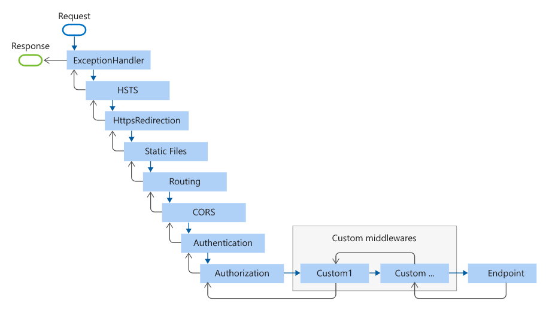

# FunWithAspNetCoreMiddlewares
### `.Run(this IApplicationBuilder app, RequestDelegate handler)`
The nature of `.Run(...)` extension is to short circuit the HTTP pipeline immediately. It is a shorthand way of adding middleware to the pipeline that does not call any other middleware which is next to it and immediately return HTTP response. So, it’s recommended to use `.Run(...)` extension to hook middleware at last in HTTP pipeline.

```csharp
app.Run(async context =>
{
    await context.Response.WriteAsync("Return From Run.");
});
```

### `.Use(Func<RequestDelegate, RequestDelegate> middleware)` 
In case of `.Use(...)` extension, there is a chance to pass next invoker, so that HTTP request will be transferred to the next middleware. 
```csharp
app.Use(next=> async context =>
{
    await context.Response.WriteAsync("Return From Use.");
    await next.Invoke(context);
});
```

### `.Map(this IApplicationBuilder app, PathString pathMatch, Action<IApplicationBuilder> configuration)`
`.Map(...)` extensions are used as convention for branching the pipeline. We can hook delegate to Map extension to push it to HTTP pipeline. `Map` simply accepts a path and a function that configures a separate middleware pipeline. In this example, we will hook one middleware/delegate to HTTP pipeline using `Map` extension.
```csharp
private static void MyDelegate(IApplicationBuilder app)
{
    app.Run(async context =>
    {
        await context.Response.WriteAsync("Returning from Map");
    });
}
    
public void Configure(IApplicationBuilder app)
{
    app.UseMvc();
    app.Map("/MyDelegate", MyDelegate);
}
```



